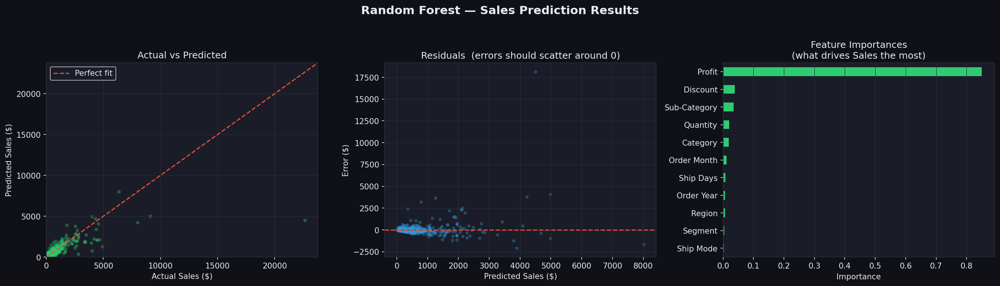

# 📈 Sales Prediction Using Machine Learning

## 📌 Overview

This project predicts retail sales using historical Superstore data and Machine Learning.

A **Random Forest Regressor** is trained using transaction, product, regional, and time-based features. The project also includes model evaluation, residual analysis, and feature importance visualization.

---

## 🎯 Features

- Data preprocessing and feature engineering
- Date-based feature extraction
- Categorical data encoding
- Sales prediction using Random Forest Regression
- Model evaluation using MAE, RMSE, and R² Score
- Actual vs Predicted visualization
- Residual error analysis
- Feature importance analysis

---

## 🛠️ Tech Stack

- Python
- Pandas
- Scikit-learn
- Matplotlib

---

## 🤖 Model

The model uses a **Random Forest Regressor** with features including:

- Quantity
- Discount
- Profit
- Order Month and Year
- Shipping Duration
- Ship Mode
- Customer Segment
- Region
- Category
- Sub-Category

The dataset is split into **80% training data and 20% testing data**.

---

## 📊 Results

The model is evaluated using:

- **MAE** — Mean Absolute Error
- **RMSE** — Root Mean Squared Error
- **R² Score** — Variance explained by the model

The visualization includes Actual vs Predicted Sales, Residual Analysis, and Feature Importance.



---

## 🚀 Run Locally

```bash
git clone <your-repository-url>
cd FUTURE_ML_01
pip install -r requirements.txt
python model.py
```

---

## 📁 Project Structure

```text
FUTURE_ML_01/
├── model.py
├── data.csv
├── sales_prediction_results.png
├── requirements.txt
└── README.md
```
---

## 👨‍💻 Author

**Sagnik Banerjee**
